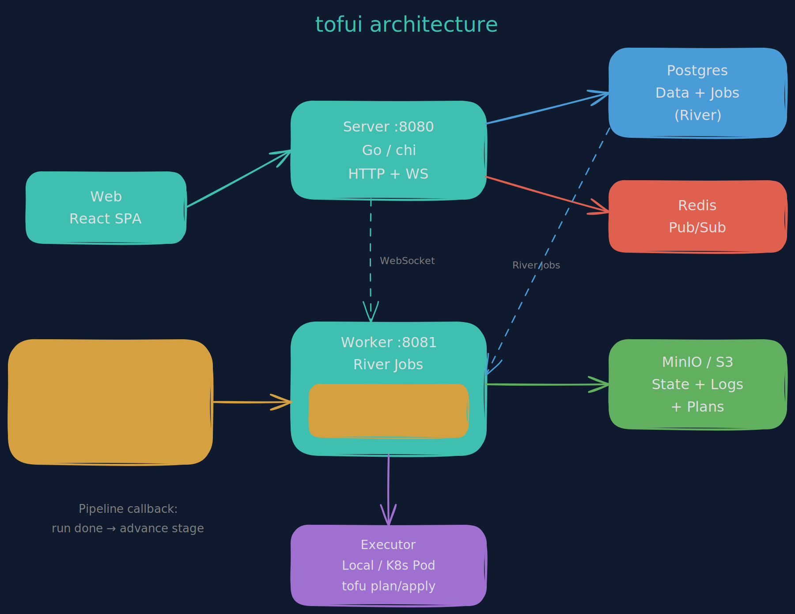

# Architecture

Tofui runs as three processes backed by three data stores.



## Processes

### Server (`:8080`)

Go HTTP API built with [chi](https://github.com/go-chi/chi). Handles authentication, CRUD operations, WebSocket log streaming, and webhook ingestion.

- **Auth**: GitHub OAuth flow issues a JWT stored in the browser's localStorage. Every API request carries it as a `Bearer` token. RBAC is enforced via middleware with four roles: `owner > admin > operator > viewer`.
- **Routing**: all routes are defined in `internal/server/server.go` in a single `setupRouter()` function.
- **Handlers**: one file per domain in `internal/handler/` — workspace, run, pipeline, variables, org_variables, pipeline_variables, teams, state, audit, etc. Handlers call services, services call the repository layer.
- **WebSocket**: run log streaming uses a WebSocket endpoint (`/runs/{runID}/logs/ws`). The server subscribes to the log streamer (Redis or in-memory) and pushes lines to the connected browser.

### Worker (`:8081`)

[River](https://riverqueue.com/) job processor. Postgres is the job queue — no separate broker needed.

- Picks up `run` and `pipeline_stage` jobs enqueued by the server
- Fetches workspace config, variables (merged from org + pipeline + workspace scopes), and previous state
- Delegates to an **executor** (local or Kubernetes)
- Uploads results (state, logs, JSON plan) to S3
- Handles post-plan branching: auto-apply, awaiting approval, or planned
- **Pipeline callback**: when a run completes, checks if it belongs to a pipeline stage and advances the pipeline
- Exposes a health endpoint on `:8081/healthz` for liveness probes
- Graceful shutdown: waits for in-progress jobs up to `SHUTDOWN_TIMEOUT`

### Web (`:5173`)

React 19 SPA served by Vite in development and nginx in production.

- **API client**: `openapi-fetch` with typed paths from `web/src/api/types.ts`
- **State management**: TanStack Query for server state, Zustand for local UI state
- **Routing**: simple regex-based matching in `App.tsx` using `window.location`
- **Terminal**: xterm.js renders real-time run logs via WebSocket
- **Styling**: Tailwind CSS 4 with Miami Dolphins dark water theme

## Data Stores

### Postgres

Primary data store and job queue. All application data lives here — workspaces, runs, pipelines, variables (org/pipeline/workspace scopes), teams, users, audit logs. River uses Postgres advisory locks and a jobs table for reliable queue semantics.

Every query is scoped by `org_id` for multi-tenant isolation.

### Redis

Pub/sub channel for real-time log streaming. When the worker produces log lines, it publishes them to a Redis channel keyed by run ID. The server subscribes and forwards to WebSocket clients.

Falls back to an in-memory fan-out if Redis is unavailable — fine for single-server dev, but logs won't stream across multiple server replicas without Redis.

### MinIO / S3

Object storage for:
- **State files**: `state/{workspaceID}/{serial}.tfstate`
- **Run logs**: `logs/{runID}/{phase}.log`
- **JSON plans**: `plans/{runID}/plan.json`
- **Config archives**: `configs/{workspaceID}/{versionID}.tar.gz` (upload workspaces)

Any S3-compatible store works (AWS S3, GCS with S3 compatibility, etc).

## Executor Model

The executor interface (`internal/worker/executor/executor.go`) abstracts how tofu commands are run.

### Local Executor

Runs `tofu` directly on the worker's host machine. Good for development and small deployments.

1. Creates a temp directory
2. Clones the git repo (VCS) or extracts the uploaded archive (upload)
3. Restores previous state if available
4. Runs `tofu init` → `tofu validate` → `tofu plan/apply/destroy`
5. Captures output, state file, and JSON plan
6. Cleans up the temp directory

### Kubernetes Executor

Runs `tofu` in ephemeral pods. Used in production for isolation and resource control.

1. Builds a shell script with the full tofu workflow
2. Creates a ConfigMap with the script, variables, and state
3. Creates a Pod that mounts the ConfigMap and runs the script
4. Streams pod logs back to the worker via the K8s API
5. Extracts state and plan JSON from stdout markers
6. Cleans up the Pod and ConfigMap

Per-workspace tofu versions are supported: the pod image is resolved from `EXECUTOR_IMAGE_PREFIX` + the workspace's configured tofu version.

## Run Lifecycle

```
pending → planning → planned ──────────────────────────> (done)
                         ├── auto_apply=true ──> queued → applying → applied
                         └── requires_approval ──> awaiting_approval
                                                     ├── approved → queued → applying → applied
                                                     └── rejected → (done, workspace unlocked)

Any active state → cancelled (via atomic conditional UPDATE)
Any failure      → errored
```

Key behaviors:
- A workspace can only have one active run. Others queue as `pending`.
- When a run finishes, the worker automatically dequeues the next pending run.
- Cancel uses a conditional `UPDATE ... WHERE status IN (cancellable)` — no TOCTOU race.
- Approval uses `SELECT FOR UPDATE` in a transaction to prevent race conditions.

## Pipeline Orchestration

Pipelines create regular workspace runs in sequence. The pipeline is an orchestrator, not an executor.

```
PipelineStageJobWorker          RunJobWorker
        │                             │
        ├── import outputs from       │
        │   previous stage            │
        ├── create workspace run ─────┤
        │   via RunService.Create()   ├── execute tofu
        │                             ├── upload state/logs
        └── (exit, short-lived)       ├── advancePipelineIfNeeded()
                                      │     ├── applied → enqueue next stage
                                      │     ├── errored → check on_failure
                                      │     ├── awaiting_approval → pause
                                      │     └── not a pipeline run → no-op
                                      └── (done)
```

See [docs/pipelines.md](docs/pipelines.md) for usage details.

## Variable Inheritance

Variables are loaded and merged at run time in the worker:

```
org_variables        ──┐
                       ├── mergeVariables() ──> executor
pipeline_variables   ──┤
                       │   key|category wins:
workspace_variables  ──┘   workspace > pipeline > org
```

Tag variables (`tags`, `default_tags`, `*_tags`) are deep-merged as JSON maps instead of replaced. This allows org-wide tags (team, cost_center) to combine with workspace-specific tags (app, component).

See [docs/variables.md](docs/variables.md) for details.

## Team Cloud Identities

Team members have an optional `cloud_identity` field for mapping tofui users to cloud provider principals:
- AWS: IAM Role ARN
- GCP: Service account email
- Azure: Principal ID

This is a data field on the team member record — tofui stores it but doesn't automatically inject it into runs. Use it as reference when building access entry variables for your cluster workspaces.

## VCS Webhook Flow

1. GitHub sends a `push` event to `POST /api/v1/webhooks/github`
2. Server verifies the HMAC-SHA256 signature using `WEBHOOK_SECRET`
3. Parses the repo URL and branch from the payload
4. Finds matching workspaces (normalized repo URL, same branch, `vcs_trigger_enabled=true`, not locked)
5. Enqueues a plan run for each matching workspace

## Multi-Tenant Isolation

Every database query includes an `org_id` filter. The org ID comes from the authenticated user's JWT claims. There is no way to query across organizations through the API.
